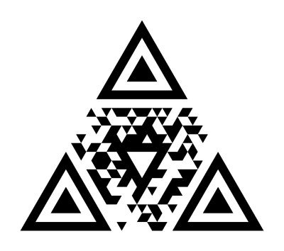

# kycode
Triangular 2D code by KysKan: SVG/PNG generator and web scanner with Reed-Solomon error correction.
KYcode

**Le code graphique triangulaire de [KysKan](https://kyskan.com).**

<p align="center"></p>

Un KYcode est un symbole en forme de triangle équilatéral : 3 repères triangulaires aux coins, un repère central inversé, et 240 cellules triangulaires de données protégées par Reed-Solomon. Ce n'est pas un QR code : il se lit avec le scanner KYcode, et il encode un identifiant court qui redirige vers `https://kyskan.com/<identifiant>`. La destination reste ainsi modifiable après impression.

- **Format** : [docs/KYcode-spec-v0.md](docs/KYcode-spec-v0.md)
- **Correction d'erreur** : jusqu'à 11 octets erronés sur 30 (≈ 37 %), davantage avec effacements
- **Décodage** : environ 17 ms par image de caméra, dans le navigateur (Web Worker)

## État du projet

| Étape                                                                | État                                         |
| -------------------------------------------------------------------- | -------------------------------------------- |
| 1. Spécification du format v0                                        | ✅                                            |
| 2. Encodeur, rendu SVG, décodeur sur image fixe, tests de robustesse | ✅                                            |
| 3. Scanner caméra web, générateur, feuille de test                   | ✅ construit — essais sur téléphones en cours |
| 4. Service de redirection kyskan.com, variantes de style             | à venir                                      |

## Démarrage

Prérequis : Node.js 18 ou plus récent.

```bash
npm install
npm test
npm run dev:local
```

Puis ouvrir http://localhost:5174 (générateur), `/scan.html` (scanner, `?demo` pour une caméra simulée) ou `/feuille-test.html`.

| Commande            | Rôle                                                                      |
| ------------------- | ------------------------------------------------------------------------- |
| `npm test`          | Tests automatiques (géométrie, Reed-Solomon, encodeur, rendu, décodeur)   |
| `npm run typecheck` | Vérification TypeScript                                                   |
| `npm run dev`       | Application web en **HTTPS** sur le réseau local (scan avec un téléphone) |
| `npm run dev:local` | Application web en HTTP sur localhost                                     |
| `npm run build`     | Version statique dans `dist/`                                             |
| `npm run limits`    | Limites du décodeur sur scènes synthétiques                               |
| `npm run bench`     | Vitesse de décodage sur une image de taille caméra                        |
| `npm run examples`  | Exemples dans `docs/exemples/`                                            |

### Tester avec un téléphone

1. `npm run dev`, puis noter l'adresse « Network » affichée (ex. `https://192.168.1.102:5173/`).
2. Sur le téléphone, connecté au même Wi-Fi, ouvrir `https://<adresse>:5173/scan.html`.
3. Accepter l'avertissement de certificat (certificat local auto-signé), puis autoriser la caméra.
4. Imprimer `feuille-test.html` à 100 %, scanner chaque code, puis « Copier l'historique ».

La caméra exige HTTPS ou localhost.

## Organisation

```
src/core/       grille, charge utile, Reed-Solomon, encodeur
src/render/     rendu SVG, rasterisation, export PNG navigateur
src/decoder/    binarisation, composantes, homographie, décodage
web/            générateur, scanner, feuille de test (Vite)
tests/          tests Vitest et scènes synthétiques
scripts/        mesures, exemples, génération des schémas
docs/           spécification et exemples
```

## Auteurs

David Guével et Vincent Trapinaud — [KysKan](https://kyskan.com)

## Licence

© 2026 David Guével et Vincent Trapinaud. **Tous droits réservés.** Ce dépôt est public pour consultation uniquement ; voir [LICENSE](LICENSE).
